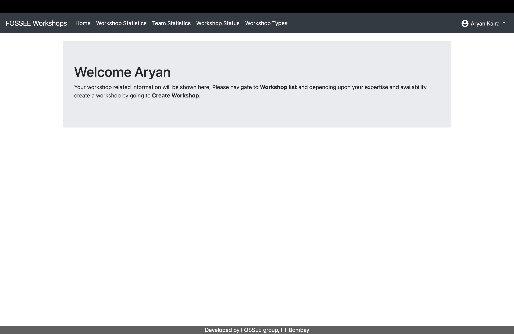
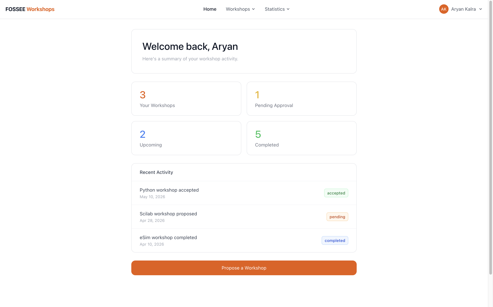
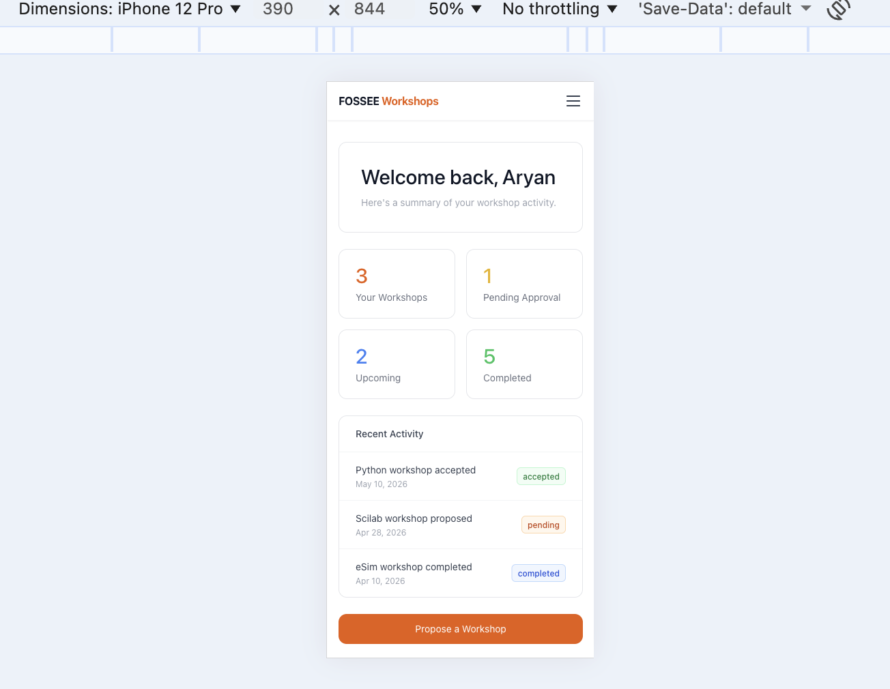
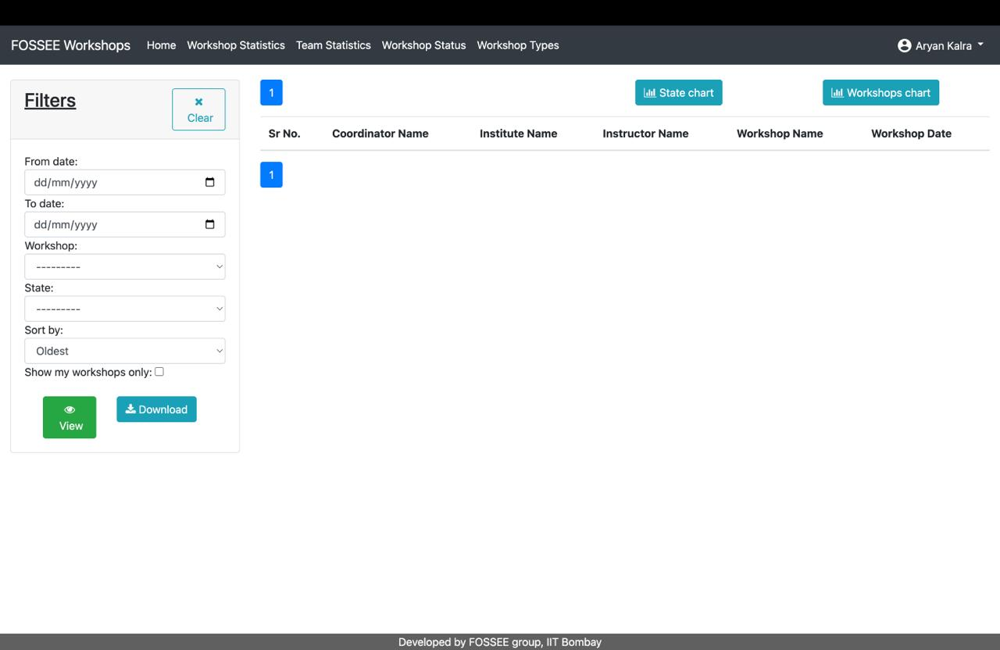
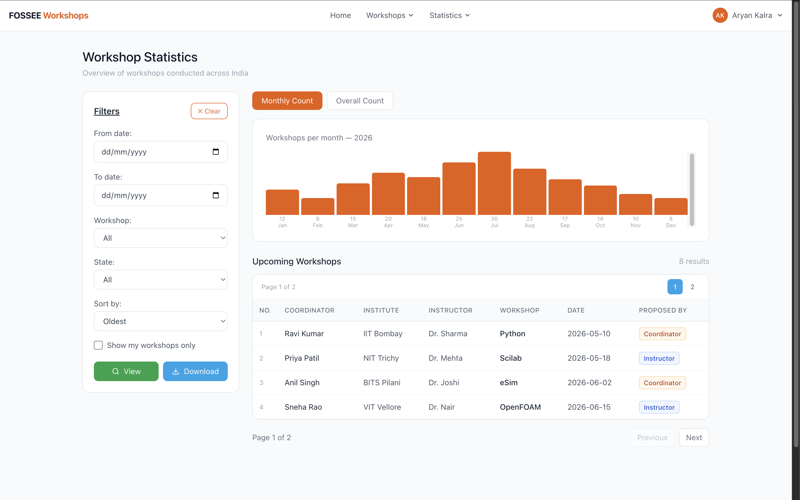
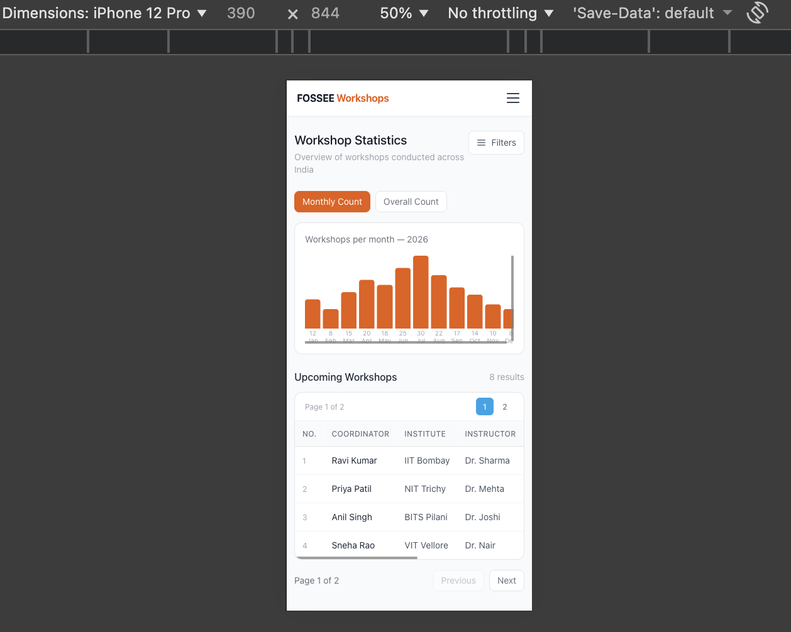
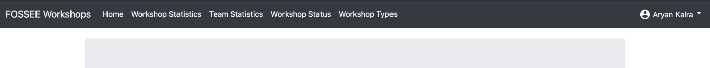
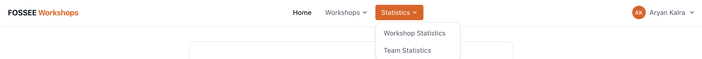

# FOSSEE Workshops - UI/UX Enhancement

A mobile-first redesign of the FOSSEE Workshops Django web app, rebuilt as a modern React + Tailwind CSS frontend.

---
## Setup Instructions

### 1. Backend Setup (Reference System)

```bash
# Clone the repository
git clone https://github.com/aryankalra404/fossee-task

# Install Python 3.11 (macOS)
brew install python@3.11

# Create and activate virtual environment
python3.11 -m venv .venv
source .venv/bin/activate

# Install requirements
pip install -r requirements.txt

# Database initialization and sync
python manage.py makemigrations
python manage.py migrate

# --run-syncdb solves 'OperationalError' issues with missing CMS tables.
python manage.py migrate --run-syncdb

# Start the Django server
python manage.py runserver
```

### 2. Frontend Setup (React Application)

```bash
# Navigate to the frontend directory
cd fossee-task/frontend

# Install dependencies
npm install

# Start the development server
npm run dev
```

---

## What design principles guided your improvements?

- **Mobile-first**: Every page was built for small screens first, then scaled up. As it was mentioned the website is primarily accessed on phones.
- **Visual hierarchy**: Clear headings, muted secondary text, and consistent spacing guide the eye naturally.
- **FOSSEE brand colors**: Used the official orange `#e85d04` from fossee.in for buttons, active states, and accents.
- **Minimal clutter**: Replaced Bootstrap's heavy table-heavy layouts with clean cards, clean tables, and whitespace.
- **Accessible**: Semantic HTML, proper labels on inputs, aria-label on icon buttons.

---

## How did you ensure responsiveness across devices?s

- Tailwind's responsive prefixes (`md:`, `sm:`) used throughout, navbar collapses to hamburger on mobile, grids stack to single column.
- Tested on iPhone 12 Pro (390px) using Chrome DevTools.
- `overflow-x-auto` on all tables so they scroll horizontally on small screens instead of breaking layout.
- Fixed navbar with `pt-14` on main content so nothing hides behind it on any screen size.

---

## What trade-offs did you make between the design and performance?

| Decision | Trade-off |
|---|---|
| Hardcoded placeholder data | Real API integration left for later, kept frontend concerns separate |
| No animations | Kept load times fast, no unnecessary JS |
| Tailwind over CSS modules | Faster to build, classes can get verbose but readable |
| React Router for navigation | Adds a dependency but gives clean client-side routing |
| Custom SVG/Flexbox Charts | Chose to build custom data visualizations instead of importing a library like Chart.js. This saved ~50KB in bundle size, ensuring the site remains lightweight for students on slower 3G/4G networks. |
| Client-Side Pagination | Implemented pagination via state slicing. While server-side is better for massive datasets, client-side pagination keeps the UX "snappy" for the current workshop volume. |

---

## What was the most challenging part of the task and how did you approach it?

**1. Tailwind CSS JIT Configuration**

**The Problem:** Initially, Tailwind styles were not generating because the `content` array in `tailwind.config.js` was empty by default.

**The Solution:** Configured the Just-In-Time (JIT) engine to scan the source directory by pointing it to `./src/**/*.{js,jsx,ts,tsx}`, ensuring only used styles were injected into the final bundle.

---

**2. State-Driven Architecture (Django to React)**

**The Problem:** Translating a server-side rendered (Django) workflow — complete with user authentication and workshop lists — into a client-side React environment without a live backend.

**The Solution:** Architected a modular state management system using React Hooks. Data structures were modeled to mirror potential JSON responses, ensuring the frontend is "API-ready" for future integration with the FOSSEE backend.

---

**3. The Data-Density Challenge (Mobile UX)**

**The Problem:** The original legacy interface relied on dense tables that caused horizontal scrolling and poor legibility on mobile devices.

**The Solution:** Implemented a Conditional Layout Strategy:

- **Desktop:** Retained semantic `<table>` elements for high-density data viewing.
- **Mobile:** Developed a custom Card UI that surfaces critical metadata (e.g., Workshop Status, Dates) through visual anchors and color-coded badges, eliminating horizontal overflow and improving accessibility.

---

| Page | Before | After (Desktop & Mobile) |
|---|---|---|
| **Home Page** |  |  <br/>  |
| **Workshop Statistics** |  |  <br/>  |
| **Navbar** |  |  |

> Screenshots are in the `/screenshots` folder.

[Demo Video Link](https://drive.google.com/file/d/1eON_3ezhCRZutN59BEoq_NbliLz19pta/view?usp=sharing)

---

## Accessibility & SEO

**Semantic Structure:**
Used proper `<header>`, `<nav>`, `<main>`, and `<footer>` tags to ensure screen readers can navigate the page structure logically.

**Form Usability:**
Every input is paired with a `<label>` and uses `htmlFor` to ensure large, accessible click targets.

**Color Contrast:**
Verified that the FOSSEE Orange (`#e85d04`) meets contrast requirements against white backgrounds for readability.

---

## Pages Built

- Home (dashboard with stat cards + activity feed)
- Login
- Register
- Workshop Status
- Workshop Types
- Workshop Statistics
- Team Statistics
- Propose Workshop
- Workshop Details
- View Profile

---

## Project Structure

```
fossee-task/
├── README.md
├── eslint.config.js
├── index.html
├── package.json
├── postcss.config.js
├── tailwind.config.js
├── vite.config.js
└── src/
    ├── App.css
    ├── App.jsx
    ├── index.css
    ├── main.jsx
    ├── components/
    │   ├── Footer.jsx
    │   └── Navbar.jsx
    ├── layouts/
    │   └── MainLayout.jsx
    └── pages/
        ├── Home.jsx
        ├── Login.jsx
        ├── ProposeWorkshop.jsx
        ├── Register.jsx
        ├── TeamStatistics.jsx
        ├── ViewProfile.jsx
        ├── WorkshopDetails.jsx
        ├── WorkshopStatistics.jsx
        ├── WorkshopStatus.jsx
        └── WorkshopTypes.jsx
```

---

## Stack

- React 18 + Vite
- Tailwind CSS v3
- React Router v6
